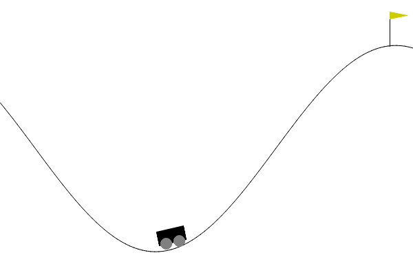

# 🏁 Competencia RL — DQN sobre `MountainCar-v0`

  

> **Damas y caballeros, arranca la temporada.** Esto no es la Fórmula 1, pero el
> espíritu es el mismo: cada escudería —su equipo— lleva su propio monoplaza a la
> pista. Solo que acá el monoplaza es una **red Q entrenada** y el circuito es la
> ladera de `MountainCar-v0`. El motor sin potencia no alcanza para subir de frente:
> hay que tomar impulso, leer el momento justo y dejar que la política haga el resto.
>
> No gana quien tiene el auto más rápido, sino quien **llega a la cima en menos pasos**
> y de forma **consistente vuelta tras vuelta** (seed tras seed). Los tiempos se miden
> contra seeds que nadie vio, el cronómetro no miente y el **podio se arma solo** en el
> [leaderboard](LEADERBOARD.md). 🏆

Entrenan su DQN localmente y suben **solo los pesos** como un archivo ONNX.
El board se actualiza solo a medida que mergeamos submissions, y el día de la
competencia corre la ronda final sobre seeds que nadie vio.

## Regla de oro

> **Solo se suben pesos. Si el PR contiene CÓDIGO, queda descalificado automáticamente.**

El PR puede tocar **únicamente** estos archivos, y solo dentro de la carpeta de tu equipo:

- `submissions/<tu-equipo>/policy.onnx`  — obligatorio
- `submissions/<tu-equipo>/metadata.json` — opcional (nombre del equipo, integrantes)

Cualquier `.py`, `.ipynb`, `.sh`, notebook, o archivo fuera de esa carpeta hace fallar la validación.

## Contrato del `policy.onnx`

Tu red Q tiene que exportarse exactamente así:

| | nombre | shape | dtype |
|---|---|---|---|
| entrada | `observation` | `[batch, 2]` | float32 |
| salida | `q_values` | `[batch, 3]` | float32 |

- La observación es `[posición, velocidad]`; las 3 acciones son empujar izquierda / nada / derecha.
- Opset **17**, solo operadores estándar de ONNX (sin dominios custom).
- La salida son los **Q-values** de las 3 acciones (no apliques argmax: lo hace el evaluador).
- La política de evaluación es greedy: `acción = argmax(q_values)`.

En `submissions/_ejemplo/export_example.py` tenés cómo exportar desde PyTorch
(ese archivo es solo guía local; **no** lo suban al repo).

## Cómo evalúa

- Una corrida por seed; con política y entorno deterministas, **más seeds = más muestras**.
- En MountainCar la recompensa es **-1 por paso** (máximo -200 si nunca llega a la meta).
  Por eso los retornos son **negativos**: cuanto **más cerca de 0**, mejor.
  Una policy sin entrenar marca -200 fijo. El ranking por la media descendente ordena bien.
- Métrica de ranking: **media** de los retornos, con intervalo de confianza al 95% por bootstrap.
  Se reporta también el **IQM** (interquartile mean, robusto a outliers) como dato informativo.
- Hay dos conjuntos de seeds: las **públicas** (`seeds/public_seeds.txt`) para que
  prueben, y un set **oculto** para el ranking real. El día D se usa un tercer set
  de holdout que nadie vio.

## Cómo subir

1. Trabajá en una **rama de este repo** (no un fork: los forks no acceden a las
   seeds ocultas y la evaluación no corre).
2. Agregá tu `policy.onnx` en `submissions/<tu-equipo>/`.
3. Abrí un PR. El bot valida, corre la evaluación y te comenta tu score de preview.
4. Al mergear a `main`, se actualiza el [leaderboard](LEADERBOARD.md).

Pueden subir **múltiples policies** (PRs sucesivos); cuenta la última de cada equipo.
